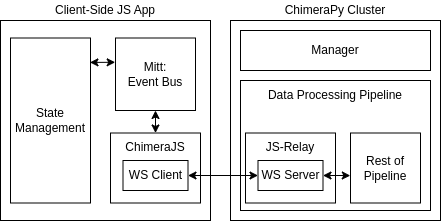

# ChimeraJS

[](https://npmjs.com/package/chimerajs)


Communication Extension for JS to ChimeraPy's Pythonic Runtime Environment



## Compatibility

Currently, the plugin is only available for VueJS applications, but it's open to PRs to extend to other tech stacks and frameworks.

## Installation

Use the following command to install the package:

```bash
npm install chimerajs
```

## Usage

First, you need to install the plugin to your Vue application. Use the following to start:

```js
import { createApp } from 'vue'
import App from '@/App.vue'
import { ChimeraJSIntegrator } from 'chimerajs'
import mitt from 'mitt'

// Create application
const app = createApp(App)

// Create the emitter
const emitter = mitt()

// Install plugin (provide the emitter instance from mitt)
// You can also omit the eventArray parameter if you can to
// capture all events and broadcast
app.use(ChimeraJSIntegrator {
    emitter: emitter,
    eventArray: ['event1', 'event1']
})

// Then mount app
app.mount('#app')
```

### Option Parameters

| Parameter Name | type         | accepted or example inputs | required            | description                                                                                                                                 |
|----------------|--------------|----------------------------|---------------------|---------------------------------------------------------------------------------------------------------------------------------------------|
| emitter        | mitt.Emitter | mitt()                     | true                | The emitter used to communicate between the front-end application and the ChimeraPy cluster.                                                |
| eventArray     | string[]     | ['event1', 'event2'] or [] | false, default = [] | Provide an array of events to listen, or [] implies all events will be broadcast. BEWARE: avoid broadcasting sensitive data like passwords. |

After installing ChimeraJS and running your application, you would want to run the python-side of ChimeraPy to obtain the events. The Node implementation can be found here: TODO

## Example

TODO